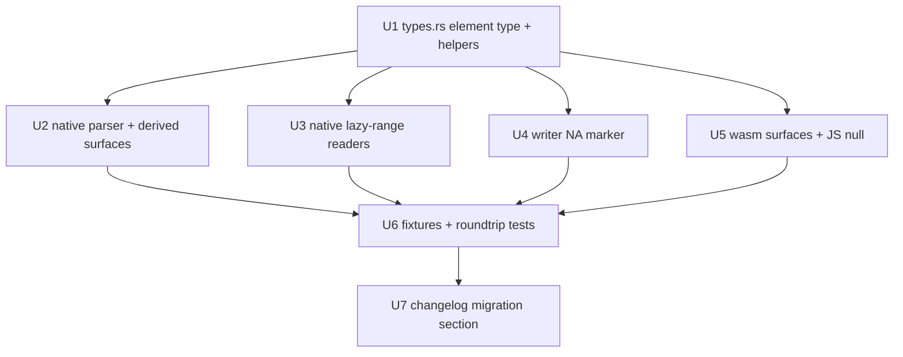

# fix: Represent NA_character_ as `Option`, end silent NA corruption

## Overview

`RObject::Character` elements change from `Arc<str>` to `Option<Arc<str>>`
(`None` = `NA_character_`), across every parse path, the writer, the lazy-range
readers, and the wasm/JS boundary. This kills the library's last
silent-corruption defect: today `NA_character_` parses as the literal string
`"NA"` and roundtrips back to R as a real `"NA"` string. Ships in the
unreleased, already-breaking 0.2.0.

## Problem Frame

See origin doc. Character is the only vector type whose NA collides with a
legal value and the only one that corrupts on roundtrip (Logical has `Na`,
Integer keeps R's `i32::MIN` sentinel, Real carries the NaN payload). Affected:
readers of string data, writers of RDS files, wasm/JS consumers.

Planning found the blast radius is wider than the origin doc recorded: the
**native** lazy-range readers also fabricate `"NA"` (`src/extraction.rs`
×2, `src/chunk_iter.rs` ×1), in addition to the sync parser sites and the wasm
readers — seven-plus NA-producing sites across five files.

## Requirements Trace

(From origin; IDs preserved.)

- R1. `Option<Arc<str>>` elements across every parse path (sync, streaming,
  wasm sequential, lazy materialization/range reads).
- R2. Real `"NA"` distinguishable from missing end-to-end.
- R3. Writer emits R's NA marker; R→rds2rust→R roundtrip is `identical()`.
- R4. wasm/lazy APIs surface NA as `null`/`None`, not a fake string.
- R5. Derived plain-string surfaces treat NA as absent; positional surfaces
  (names in place, factor level slots) preserve positions.
- R6. Ergonomic construction + accessor helpers + explicit render-NA escape hatch.
- R7. Ships in 0.2.0 with a CHANGELOG migration section.
- R8. Debug/Display renders NA distinctly (`<NA>`), never as bare `NA`.

## Scope Boundaries

(From origin.) No validity mask; no changes to Integer/Real/Logical NA; no
tri-valued equality; derived string types stay non-optional except the factor-
level carve-out. Additionally decided in planning:

- **Character lazy *materialization* stays `Unsupported`** (status quo in
  `src/materialization.rs`) — retyped for `Option` but not implemented; a
  documented limitation and separate follow-up. Lazy *range reads*
  (`extraction.rs` / `chunk_iter.rs` / wasm) ARE in scope — they already work
  and currently fabricate `"NA"`.

## Context & Research

### Relevant Code and Patterns

- `src/types.rs:233` — `Character(VectorData<Arc<str>>)`; `VectorData<T>` is
  fully generic with `From<Vec<T>>` (types.rs:164), so `.into()` construction
  adapts automatically once the element type changes.
- NA-producing sites: `src/parser.rs` (two `String::from("NA")` returns in
  `parse_charsxp_content` + async twin, each with a NILSXP arm),
  `src/extraction.rs:1488,1615`, `src/chunk_iter.rs:470`,
  `src/wasm/extract.rs:440`, `src/wasm/async_chunk_iter.rs:254`.
- `src/writer.rs:1161` `write_charsxp(&str)` — never emits the NA marker;
  `write_character_vector` (writer.rs:820 context) iterates elements; two
  single-element `Character` matches at writer.rs:1265/1347.
- Derived-surface sites: `extract_tag_name` (parser.rs, already by-ref),
  factor conversion (parser.rs:9629 builds `FactorData.levels` from a loaded
  Character), `convert_to_s3_object` (parser.rs:9663, class extraction),
  `parse_string_vec` (feeds PERSISTSXP Character and Namespace names).
- `dedup_fingerprint` (parser.rs) hashes Character contents — must hash
  `None` distinctly from `Some("NA")`.
- wasm boundary: `strings_to_js` (`src/wasm/extract.rs:223`),
  `read_lazy_character_range_async` (extract.rs:106).
- Fixture/test conventions: `tests/generate_test_data.R` + fixture-gated test
  files; R-gated roundtrip verification pattern in
  `tests/refsxp_alignment_tests.rs` (`r_available()` + `stopifnot(identical(...))`).
- Precedent for explicit NA: `Logical { True, False, Na }` (types.rs:1409).

### External References

- R `serialize.c` NA_STRING wire format, **verified empirically** (origin doc,
  resolved 2026-07-10): bare CHARSXP flags `0x00000009` (no encoding-level
  bits) + int32 −1. Regular strings carry level bits (e.g. `0x00040009`).

## Key Technical Decisions

- **`Option<Arc<str>>`** (origin decision; niche-optimized, verified 16 bytes).
- **NILSXP-in-CHARSXP-position → `None`**: R has exactly one character
  missing value; the NILSXP arm is a defensive path for the same "no string
  here" semantics. A third state would contradict R's own type system.
- **JS boundary: `None` → `null`** (not `undefined`): survives
  `JSON.stringify`, idiomatic for "present but missing" in JS data.
- **Factor NA level: `FactorData.levels` becomes `Vec<Option<Arc<str>>>`**
  (the origin's carve-out): positional integrity is non-negotiable (values
  index into levels), and an optional slot is the only representation that
  neither fabricates a string nor corrupts indices. NA levels are rare
  (`factor(..., exclude = NULL)`), so the consumer burden is minimal.
- **`parse_charsxp_content` (and async twin) return an optional string** so
  NA-ness originates at the lowest level; symbol-name parsing (which cannot
  legally be NA in R) maps a `None` there to an `InvalidFormat`-style error
  rather than inventing a name.
- **Materialization stays `Unsupported`** (see Scope Boundaries) — smallest
  honest scope; implementing character materialization is orthogonal work.
- **The compiler is the migration tool**: change the element type first and
  fix every resulting error site with an explicit NA policy; no shims that
  would let old behavior survive.

## Open Questions

### Resolved During Planning

- NILSXP mapping → `None` (rationale above).
- JS `null` vs `undefined` → `null`.
- Character materialization in 0.2.0 → no; stays `Unsupported`, retyped.
- Factor NA-level slot → optional level entries in `FactorData`.
- R's NA wire bytes → resolved in origin doc (bare flags + −1).
- Helper affordances (R6) → `from_strs`-style constructor, `Option<&str>`
  element accessor, `Option`-aware iterator, and a render-with-placeholder
  escape hatch; exact names at implementer's discretion.

### Deferred to Implementation

- Exact helper method names/signatures (existence and semantics are fixed).
- Whether the writer's single-element `Character` matches (writer.rs:1265/1347
  — name-ish contexts) can legally carry `None`; decide when reading the code
  (likely error or skip like symbols).
- The dedup fingerprint's exact `Option` hash encoding (any encoding
  distinguishing `None` from all `Some` values is acceptable).
- Whether any `From`/`Into`/iterator adapters exist that would bypass the
  `Option` (inventory falls out of the compile-error sweep; none found in a
  preliminary scan beyond the generic `From<Vec<T>>`, which adapts safely).

## Implementation Units

Dependencies are linear from Unit 1, then fan out:

- [x] **Unit 1: Core representation and helpers in types.rs**

**Goal:** `Character(VectorData<Option<Arc<str>>>)`; `FactorData.levels`
becomes `Vec<Option<Arc<str>>>`; construction/accessor helpers; `<NA>`
rendering.

**Requirements:** R1, R5 (levels), R6, R8

**Dependencies:** None

**Files:**
- Modify: `src/types.rs`
- Test: unit tests colocated or in `tests/na_character_tests.rs` (created in U6; helper-level asserts may live in types.rs `#[cfg(test)]`)

**Approach:**
- Change the two type definitions; let the compiler enumerate every consumer.
- Add helpers per R6 (plain-string constructor wrapping in `Some`;
  `Option<&str>` accessor; iterator; explicit placeholder-rendering escape
  hatch). The existing generic `From<Vec<T>>` keeps `.into()` working.
- Debug/Display paths that print character values render `None` as `<NA>`
  (matching R), never `NA` or Rust's `None`.
- `PartialEq`/clone need no semantic change (`Option` derives through), but
  verify the manual `PartialEq` impl compiles through the new element type.

**Test scenarios:**
- Happy path: helper constructor from plain strs yields all-`Some` vector;
  accessor returns `Some("x")` / `None` appropriately.
- Edge case: empty vector; all-`None` vector; `Some("NA")` vs `None` compare
  unequal.
- Happy path: Display/Debug of a vector containing `None` shows `<NA>`.

**Verification:** crate compiles only after U2–U5 (expected); helper unit
tests pass once compilation is restored.

- [x] **Unit 2: Native parser paths and derived-surface policies**

**Goal:** All native NA-producing sites return `None`; derived surfaces follow
R5; dedup distinguishes `None` from `Some("NA")`.

**Requirements:** R1, R2, R5

**Dependencies:** Unit 1

**Files:**
- Modify: `src/parser.rs`
- Test: `tests/na_character_tests.rs` (U6)

**Approach:**
- `parse_charsxp_content` (+ async twin) return an optional string: length −1
  and the NILSXP arm → `None`. Symbol-name callers treat `None` as a format
  error (symbols cannot be NA in R).
- `parse_character_vector_full` and its `string_cache` (REFSXP per-vector
  cache) carry `Option` elements.
- `parse_string_vec` returns optional elements: PERSISTSXP surfaces them in
  its Character result; Namespace/package name construction skips `None`
  (derived rule — a namespace name cannot be NA).
- `extract_tag_name`: a `None` first element yields `None` (unnamed), exactly
  like a missing tag.
- `convert_to_s3_object` class extraction and any class-string readers skip
  `None` entries.
- Factor conversion (parser.rs:9629) carries `Option` levels through to
  `FactorData` positionally — no skipping.
- `dedup_fingerprint`: hash `Option` discriminant + contents so `None` and
  `Some("NA")` land in different buckets (equality already distinguishes).
- Streaming parser character paths get the same element treatment.

**Test scenarios:** (fixtures from U6)
- Happy path: `c("NA", NA_character_)` parses to `[Some("NA"), None]`.
- Integration: NA inside a `names` attribute → that element is unnamed;
  other names unaffected; positions preserved.
- Integration: NA inside a `class` vector → class list skips it; object still
  classifies by remaining classes.
- Integration: factor with an NA level (`exclude = NULL`) → level slot is
  `None`, values pointing at other levels resolve unchanged.
- Edge case: dedup — a vector containing `Some("NA")` and another containing
  `None` are never conflated by the cache.
- Error path: a symbol whose name CHARSXP is the NA marker → parse error, not
  a symbol named "NA".

**Verification:** all scenarios pass; full native suite passes with updated
assertions.

- [x] **Unit 3: Native lazy-range readers**

**Goal:** `extraction.rs` / `chunk_iter.rs` range reads yield `None` instead
of fabricated `"NA"`; materialization stays `Unsupported` but compiles with
the new types.

**Requirements:** R1, R4

**Dependencies:** Unit 1

**Files:**
- Modify: `src/extraction.rs`, `src/chunk_iter.rs`, `src/materialization.rs`
- Test: `tests/na_character_tests.rs` (lazy-range case)

**Approach:** the three `Arc::from("NA")` sites return `None`; return-type
plumbing follows the compiler. `materialization.rs` keeps its `Unsupported`
error for Character (documented limitation).

**Test scenarios:**
- Happy path: lazy range read over a fixture character vector containing NA
  yields `None` at the right index and `Some` elsewhere.
- Edge case: range consisting entirely of NAs.

**Verification:** lazy-path tests pass; no fabricated `"NA"` remains
(grep-clean for the fabrication pattern outside tests).

- [x] **Unit 4: Writer NA marker**

**Goal:** `None` roundtrips to R as true `NA_character_`.

**Requirements:** R2, R3

**Dependencies:** Unit 1

**Files:**
- Modify: `src/writer.rs`
- Test: `tests/na_character_tests.rs` (roundtrip cases)

**Approach:**
- `write_charsxp` accepts an optional string; `None` emits the verified wire
  form: bare CHARSXP flags `0x00000009` + int32 −1 (no level bits, no bytes).
  `Some` keeps the current path (with its encoding-level flags).
- `write_character_vector` and factor-level writing pass elements through;
  an `Option` level writes the same NA marker.
- The single-element `Character` matches at writer.rs:1265/1347 decide their
  `None` policy when read in context (deferred note).

**Test scenarios:**
- Happy path: write `[Some("NA"), None]`, re-read with rds2rust → identical
  `Option` values.
- Integration (R-gated, mirroring `tests/refsxp_alignment_tests.rs`): write,
  then `readRDS` in R and `stopifnot(identical(x, c("NA", NA_character_)))`.
- Integration: factor with `None` level roundtrips through R identically.
- Edge case: byte-exact check that the NA element emits flags `0x00000009` +
  `0xFFFFFFFF` (the verified R form).

**Verification:** R-verified roundtrip passes; success criterion 1 of the
origin doc is met.

- [x] **Unit 5: wasm surfaces and JS boundary**

**Goal:** wasm parse paths produce `None`; JS receives `null`.

**Requirements:** R1, R4

**Dependencies:** Unit 1

**Files:**
- Modify: `src/wasm/extract.rs`, `src/wasm/async_chunk_iter.rs`, wasm-cfg'd
  paths in `src/parser.rs`
- Test: `tests/wasm_payload_tests.rs` or a new wasm test file (embedded
  R-captured stream containing `c("NA", NA_character_)`)

**Approach:** the two wasm `Arc::from("NA")` sites return `None`;
`strings_to_js` maps `None` → `JsValue::NULL`;
`read_lazy_character_range_async` element type follows. Run wasm tests via
the established direct-runner recipe (wasm-pack remains broken repo-wide).

**Test scenarios:**
- Happy path (wasm, embedded stream): `c("NA", NA_character_)` parses via the
  sequential path to `[Some("NA"), None]`.
- Integration: `strings_to_js` output has `null` (not `"NA"`) at the NA index.

**Verification:** wasm tests pass under `wasm-bindgen-test-runner`;
`cargo check --target wasm32-unknown-unknown` clean.

- [x] **Unit 6: Fixtures and end-to-end tests**

**Goal:** The origin's success criteria are pinned by tests.

**Requirements:** R1–R5, success criteria

**Dependencies:** Units 2–5

**Files:**
- Modify: `tests/generate_test_data.R`
- Create: `tests/na_character_tests.rs`
- Modify: existing test files whose assertions change shape

**Approach:** fixtures per the origin's sharpened success criteria:
`c("NA", NA_character_)`; a list with an NA in its `names`; an object with NA
in its class vector; a factor with an NA level (`exclude = NULL`); a
data-frame string column with NAs. Update existing test assertions
(`.as_deref()` shape) as the compiler directs. Re-run the real-world help-DB
check as regression.

**Test scenarios:** enumerated within Units 2–5; this unit hosts them plus:
- Integration: data-frame string column with NA parses and (native) lazy
  range-reads agree with the eager parse.
- Regression: the `stats::acf` help-DB entry still matches R exactly.

**Verification:** full native + wasm suites green; fixture regeneration
documented (repo convention).

- [x] **Unit 7: CHANGELOG migration section**

**Goal:** R7 — downstream users can migrate from the changelog alone.

**Requirements:** R7, R8 (documented)

**Dependencies:** Units 1–6 (final helper names known)

**Files:**
- Modify: `CHANGELOG.md`

**Approach:** extend the 0.2.0 Breaking section: element-type change with
before/after snippets for element access, iteration, construction, and test
assertions; the derived-surface policies; the factor-level carve-out; the
writer now emitting true NA (new capability); `<NA>` display; the JS `null`
change; the explicit escape hatch reproducing old behavior.

**Test scenarios:** Test expectation: none — documentation unit.

**Verification:** every observable change from Units 1–5 appears; snippets
compile conceptually against the final helper names.

## Execution Findings

- `src/streaming.rs` was a blast-radius file the plan missed (metadata
  summaries); NA class entries skip, NA column names render `<NA>` in the
  positional metadata summary.
- 55 native + 25 wasm compile errors drove the migration; ~150 test
  assertion/construction sites migrated (two scripted passes + residuals).
- `test_character_with_na` had pinned the corrupt behavior
  (`Some("NA")` for a true NA) and now asserts `None`.
- `write_rds` gzips by default; byte-level and lazy-range tests operate on
  the gunzipped stream (flate2 added as dev-dependency).
- All verified: 359 native + 7 wasm tests, R-verified `identical()`
  roundtrip, byte-exact NA wire form, real-world help-DB entry unchanged.

## System-Wide Impact

- **API surface parity:** native eager, native streaming, native lazy-range,
  wasm sequential, wasm lazy-range, and the writer all change element type in
  lockstep — U2–U5 exist precisely to keep parity; the compiler enforces it.
- **Interaction graph:** dedup cache and `PartialEq` (distinguish `None`);
  `extract_tag_name`/attribute naming (NA → unnamed); S3 class conversion;
  factor decode/encode; JS conversion layer.
- **Error propagation:** symbol-name-NA becomes a parse error (new, correct);
  everything else flows as values, not errors.
- **Unchanged invariants:** Integer/Real/Logical NA handling; `Shared`
  wrapping rules; reference-table semantics; attribute-keys/symbols stay
  plain strings; `materialization.rs` Character support status.
- **Integration coverage:** the R-gated write→`readRDS`→`identical()` test is
  the one scenario unit tests cannot substitute for.

## Risks & Dependencies

| Risk | Mitigation |
|------|------------|
| Blast radius larger than inventoried (~127 Character mentions in core files) | The type change makes every missed site a compile error, not a runtime bug; that is the chosen migration mechanism |
| Old fixture-based tests assert `"NA"` where NA was meant | Each is reviewed at compile/assert failure; distinguishing them is exactly the point — update to `None` where the fixture wrote true NA |
| Factor `Option` levels ripple to factor consumers | Levels are rarely NA; consumers get compile errors with an obvious `Some`-unwrap for the common case |
| wasm test harness limitations | Established direct-runner recipe; wasm32 compile check as backstop |
| Writer emits wrong flags for NA | Wire form empirically pinned (bare `0x09` + −1); byte-exact test in U4 |

## Documentation / Operational Notes

- CHANGELOG is the deliverable of U7; version stays unbumped per release
  discipline (0.2.0 cut is a separate step).
- Contributors must re-run `Rscript tests/generate_test_data.R` (repo
  convention).
- Note the Character-materialization limitation in the changelog if it was
  ever implied to work (it errors `Unsupported` today; unchanged).

## Sources & References

- **Origin document:** docs/brainstorms/2026-07-10-na-character-representation-requirements.md
- Related code: `src/types.rs:233`, `src/parser.rs` (charsxp/factor/class/dedup
  sites), `src/writer.rs:1161`, `src/extraction.rs`, `src/chunk_iter.rs`,
  `src/wasm/extract.rs`, `src/wasm/async_chunk_iter.rs`
- Wire format: R `serialize.c` NA_STRING handling, verified by hexdump
  2026-07-10 (recorded in origin doc)
